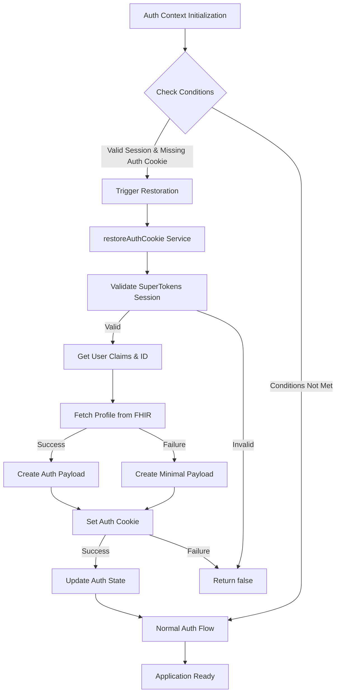
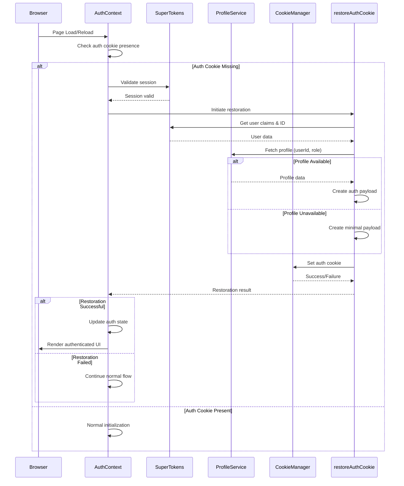

# Architecture Overview: Konsulin Frontend

## System Architecture

The Konsulin frontend is a Next.js application, which inherently follows a React-based component architecture. It's a Single Page Application (SPA) with server-side rendering (SSR) capabilities provided by Next.js.

```mermaid
graph TD
    A[User Browser] --> B(Next.js Frontend);
    B --> C{API Gateway / Backend Services};
    C --> D[Authentication Service];
    C --> E[Data Service (FHIR)];
    C --> F[Other Microservices];

    B --> G(Components);
    B --> H(Pages);
    B --> I(API Routes - Next.js);
    G --> J(Radix UI / Tailwind CSS);
    H --> J;
    I --> C;

    B --> K[Auth Services];
    K --> L[Auth Cookie Restoration];
    L --> D;
    L --> E;
```

## Key Technical Decisions

- **Next.js**: Chosen for its SSR capabilities, file-system based routing, API routes, and optimized performance, which are crucial for a complex application like Konsulin.
- **React**: Provides a declarative and component-based approach to building user interfaces, enhancing reusability and maintainability.
- **TypeScript**: Ensures type safety, reducing runtime errors and improving code quality and developer experience.
- **Tailwind CSS**: A utility-first CSS framework for rapid UI development and consistent styling.
- **Radix UI**: Provides unstyled, accessible UI components that integrate well with Tailwind CSS, allowing for highly customizable and accessible interfaces.
- **NextAuth.js & Supertokens**: For robust and flexible authentication, supporting various authentication strategies, including user session and role management.
- **React Query**: For efficient data fetching, caching, and synchronization with the backend APIs.
- **FHIR Integration**: Utilizing `@aehrc/smart-forms-renderer` and `@types/fhir` for standardized healthcare data exchange and form rendering.
- **Docker**: For consistent development and deployment environments, ensuring portability and scalability.

## Design Patterns in Use

- **Component-Based Architecture**: UI is broken down into reusable, independent components.
- **Container/Presentational Pattern**: Separation of concerns between logic (containers) and UI rendering (presentational components).
- **Hook-based Logic**: Leveraging React Hooks for stateful logic and side effects within functional components.
- **API Layer Abstraction**: Services layer (`src/services/api`) to abstract API calls, promoting reusability and testability.
- **Context API / React Query**: For global state management and efficient data flow.

## Component Relationships

Components are organized hierarchically, with `src/components` housing reusable UI elements. Pages in `src/app` compose these components to form complete views. Context providers (`src/context`) manage global state accessible by various components.

## Critical Implementation Paths

- **Authentication Flow**: Secure user registration, login, session management, role-based access control, and logout, primarily managed by Supertokens.
- **Auth Cookie Restoration**: Automatic recovery mechanism for maintaining user sessions when auth cookies become desynchronized from SuperTokens sessions.
- **Data Synchronization**: Efficiently fetching, updating, and caching healthcare data (FHIR resources) with the backend.
- **Appointment Booking**: Complex flow involving practitioner/clinic search, availability checking, and scheduling.
- **Dynamic Form Rendering**: Rendering and handling submissions of FHIR-based questionnaires and assessments.
- **Real-time Communication**: Implementation of messaging and notification features.

## Auth Cookie Restoration Mechanism

### Overview

The auth cookie restoration feature is a critical component of the authentication system that addresses edge cases where the application's auth cookie becomes desynchronized from the SuperTokens session state. This mechanism ensures continuous user sessions and prevents unnecessary logouts.

### Architecture Diagram



### Key Components

1. **Auth Context (`src/context/auth/authContext.tsx`)**: Detects restoration conditions and orchestrates the process
2. **Auth Service (`src/services/auth.ts`)**: Contains the `restoreAuthCookie()` function with core restoration logic
3. **SuperTokens Session**: Source of truth for authentication state validation
4. **Profile Service (`src/services/profile.tsx`)**: Provides user profile data for auth payload construction
5. **Cookie Management**: Handles auth cookie persistence and retrieval

### Service Details

#### `restoreAuthCookie()` Service

**Location**: `src/services/auth.ts`

**Responsibilities**:

- Validate SuperTokens session existence
- Retrieve user claims and identification
- Fetch profile data from FHIR service
- Construct comprehensive auth payload
- Set auth cookie with proper data structure
- Handle all error scenarios gracefully

**Integration Points**:

- Called by Auth Context during initialization
- Uses SuperTokens session context
- Depends on profile service for user data
- Utilizes existing cookie setting mechanism

### Data Flow



### Error Handling Strategy

The restoration mechanism employs a multi-layered error handling approach:

1. **Session Validation Errors**: Catches failures in SuperTokens session checks
2. **Claim Retrieval Errors**: Handles issues with user role and ID retrieval
3. **Profile Fetch Errors**: Provides fallback for missing or unavailable profile data
4. **Cookie Setting Errors**: Manages failures in auth cookie persistence
5. **Graceful Degradation**: Ensures application continues functioning even if restoration fails

### Performance Characteristics

- **Trigger Conditions**: Only during auth context initialization when specific conditions are met
- **Execution Time**: Typically 100-300ms (network-dependent for profile fetch)
- **Resource Usage**: Minimal CPU/memory footprint with single network request
- **Optimization Opportunities**: Caching, debouncing, and parallelization available

### Security Considerations

- **Data Validation**: All inputs validated before processing
- **Privacy Compliance**: No sensitive data included in auth payload
- **Session Integrity**: Only operates with validated SuperTokens sessions
- **Fallback Safety**: Minimal payload contains only essential, non-sensitive data

### Testing Coverage

The feature includes comprehensive testing:

- **Unit Tests**: All success/failure paths in `src/services/auth.test.ts`
- **Integration Tests**: Auth context integration scenarios
- **End-to-End Tests**: Complete user flow tests in `src/e2e/authCookieRestoration.e2e.test.ts`
- **Edge Case Testing**: Multiple reloads, role-specific scenarios, error conditions

### Documentation Resources

- **Technical Documentation**: `src/services/auth.md` - Detailed implementation guide
- **Developer Guide**: `docs/auth-cookie-restoration.md` - Usage and troubleshooting guide
- **Test Files**: Comprehensive test examples and scenarios

### Future Enhancements

1. **Performance Optimization**: Add caching layer for profile data
2. **Enhanced Monitoring**: Implement restoration analytics and metrics
3. **Advanced Error Recovery**: Add retry logic for transient failures
4. **Cross-Tab Synchronization**: Improve multi-tab coordination
5. **User Notification**: Optional notification when restoration occurs
